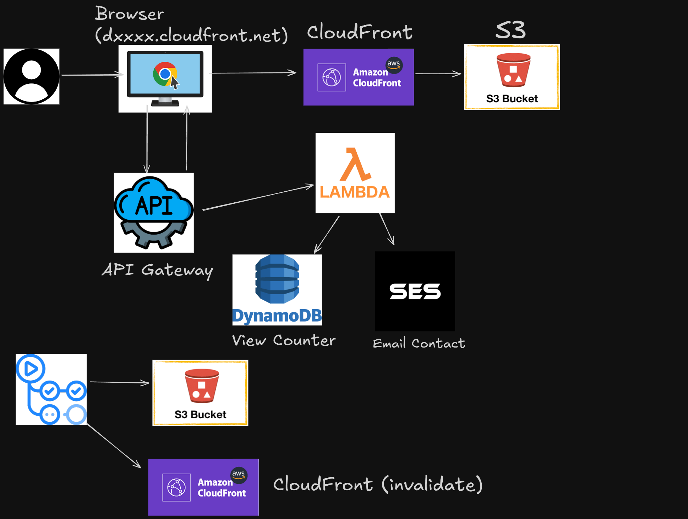

# Cloud Resume — S3 + CloudFront + Lambda Counter

A lightweight, extensible online resume/portfolio. The frontend is **static HTML/CSS/JS** hosted on **Amazon S3** and accelerated by **Amazon CloudFront**. The backend implements a **visitor counter** with **API Gateway + AWS Lambda + DynamoDB** (optional **SES** for a contact form). This project currently uses the **default CloudFront domain** (no custom domain/Route 53 yet).

**Live Demo**
- https://d142g2ii1hj9c0.cloudfront.net/

---

## About the project

This project is my submission for the Cloud Resume Challenge, showcasing my skills in AWS services and GitHub Actions. I've created a static React resume website using AWS services such as S3 for storage, AWS CloudFront for content delivery, Certificate Manager for SSL/TLS certificates, AWS Lambda for serverless functions, and DynamoDB for database management.
For the CI/CD process, I've implemented GitHub Actions workflows for both the frontend and backend. The workflows use Terraform to manage infrastructure as code, enabling automated deployment and scaling of the application.
Overall, this project demonstrates my proficiency in leveraging AWS services and implementing CI/CD pipelines using GitHub Actions for building modern web applications.

---

## 🧭 Architecture

---

## 🔧 Built With

- 
- 
- 
- 
- 
- 
- 
- 
- [-232F3E?logo=amazon-aws&logoColor=white)](https://docs.aws.amazon.com/ses/)
- 

---

## 🗺️ Roadmap

- [x] Host static site on **S3**
- [x] Serve over HTTPS via **CloudFront**
- [x] Implement **visitor counter** (API Gateway → Lambda → DynamoDB)
- [x] Enable **CORS** for public API calls
- [x] Add **deployment step** to sync S3 + CloudFront invalidation
- [ ] Add **custom domain** with **ACM** + **Route 53**
- [ ] Add **contact form** (API + Lambda + **SES**)
- [ ] Add **analytics/geo visualization** and simple dashboard
- [ ] Improve **project search / tag filters**
- [ ] Optimize **Lighthouse** performance scores

