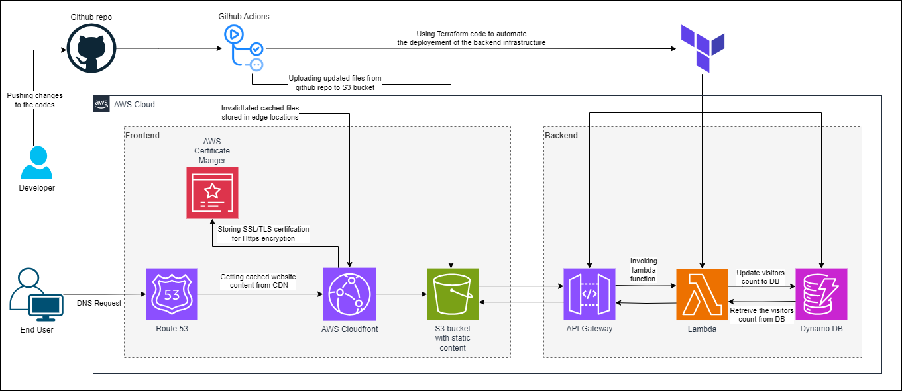

# Naveen raj - AWS Resume
## About The Project
This is my Cloud Resume Challenge built on AWS. It's a static website hosted on AWS S3 bucket, with a visitor counter built on AWS Lambda functions. The website is built with HTML, CSS, and JavaScript. The visitor counter is built with Python and AWS lambda functions. 

## Demo

[View it live here](https://resume.naveenraj.net)

## Structure

- `.github/workflows/`: Folder contains CI/CD workflow configurations.
- `frontend/`: Folder contains the website.
    - `index.html`: file contains frontend website code.
    - `js/visitorcount.js`: file contains visitor counter code to retrieve & update the visitors count.
- `infra/`: Folder contains the infrastructure codes.
    - `lambda/lambda_function.py`: Contains the visitor counter code which is deployed on lambda function.
    - `main.tf`: Contains the backend infrastructure written as terraform code.

## AWS Services Used
- Route 53
- Cloudfront
- S3 bucket
- Certificate Manager
- Lambda function
- API Gateway
- Dynamo DB

## Blog
- https://naveend3v.medium.com/my-cloud-resume-challenge-project-6f726ed58d60

flowchart LR
  %% =========================
  %%  Clients
  %% =========================
  user([End&nbsp;User Browser])

  %% =========================
  %%  Frontend on AWS
  %% =========================
  subgraph FE[Frontend (AWS Cloud)]
    r53[Route&nbsp;53 DNS]
    acm[ACM HTTPS cert]
    cf[CloudFront OAC -> S3]
    s3[(S3 Bucket private static site)]
  end

  %% DNS & TLS
  user -->|DNS| r53 --> cf
  acm -. cert used by .- cf
  cf -->|signed read (OAC)| s3
  user <--> cf

  %% =========================
  %%  Backend (Serverless APIs)
  %% =========================
  subgraph BE[Backend (Serverless)]
    api[API Gateway HTTP API]
    l_vis[Lambda visitor-counter]
    l_mail[Lambda contact mailer]
    ddb[(DynamoDB table: resume-p PK: id, attr: view)]
    ses[Amazon SES email out]
  end

  %% Browser calls
  user -- GET /counter --> api
  user -- POST /contact --> api

  %% Lambda flows
  api --> l_vis --> ddb
  api --> l_mail --> ses

  %% =========================
  %%  CI/CD
  %% =========================
  subgraph CI[CI/CD]
    dev[Developer]
    gh[GitHub Repo]
    act[GitHub Actions OIDC AssumeRole]
    tf[Terraform IaC]
  end

  dev -->|push| gh --> act
  act -->|sync frontend/| s3
  act -->|create invalidation| cf
  act -.->|provision/update| tf
